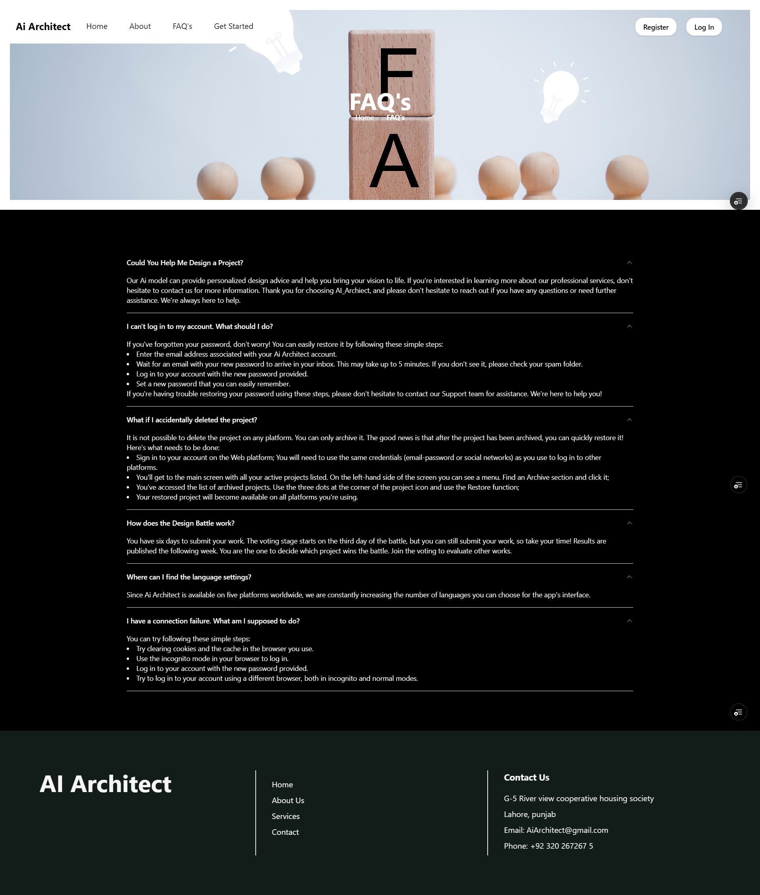

# 🏠 AI Architect

**AI Architect** is an intelligent web application that empowers users to design 2D house floor plans and receive real-time, AI-driven suggestions through an integrated chatbot. The system uses supervised learning to generate custom layouts based on user input, and further enhances the design by creating both **exterior** and **interior** visualizations.

---

## 🚀 Features

- ✨ **2D Floor Plan Prediction**  
  Generate tailored house layouts simply by providing your design requirements.

- 💬 **Integrated Chatbot Assistance**  
  Receive live feedback and intelligent suggestions while designing your dream home.

- 🏡 **Exterior & Interior Design Generation**  
  Automatically produce detailed exterior and interior layouts after selecting a plan.

---
## 🚀 Live Demo

Explore AiArchitect step by step:

| Step                      | Preview                                                |
|---------------------------|--------------------------------------------------------|
| Home                      |                         | 
| Signup                    |                              |
| Login                     |                                |
| AboutUs                   |                             |
| FAQs                      |                              |
| Contact                   |                           |
| FloorPlan                 |                         |
| Exterior Designs          |                          |
| 3D on Exterior            |                           |
| Interior Designs          |                  |

> **Note:** Screenshots are in the `demo/` folder. Replace these with your actual app screenshots for best presentation.

## 🛠 Tech Stack

- **Frontend:** TypeScript, JavaScript, CSS  
- **Backend:** Python, Django, Django REST Framework  
- **AI Model:** Supervised Learning for floor plan prediction

---

## ⚙️ Getting Started

### 📦 Prerequisites

- [Node.js](https://nodejs.org/) & npm
- [Python 3.x](https://www.python.org/)
- [Django](https://www.djangoproject.com/)
- [Django REST Framework](https://www.django-rest-framework.org/)

---

### 📁 Installation

#### 1️⃣ Clone the Repository

```bash
git clone https://github.com/suleman12344/ai_architect.git
cd ai_architect

# Create and activate a virtual environment
python -m venv venv
source venv/bin/activate        # On Windows: venv\Scripts\activate

# Install dependencies
pip install -r requirements.txt

# Run migrations and start the backend server
python manage.py migrate
python manage.py runserver

# Navigate to the frontend directory
cd frontend

# Install frontend dependencies
npm install

# Start the development server
npm start


